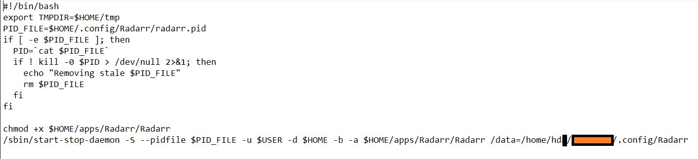
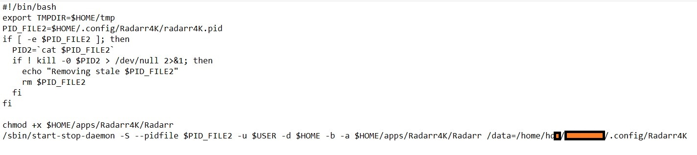
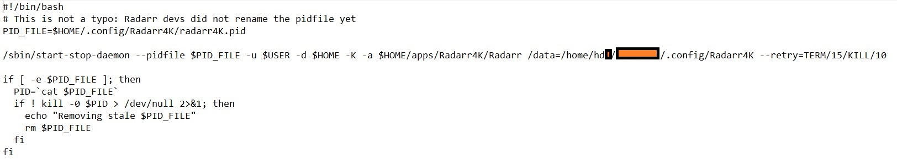

# Radarr 4K Instance

- Multiple instances of Radarr can be run by initiating another instance on a different port.

## Prerequisite

- Radarr v3 - If you haven't updated to Radarr v3, you can follow [this guide](https://github.com/pranscript/plex_bytesized/blob/master/radarr/radarrV2%20to%20V3(nightly).md) to update it. At the time of writing, it is still in nightly stage so we have to update it manually.
- Proceed further after updating

## Steps

1. clone Radarr folder inside ```~/.config```  as radarr4K

   1. Can do either by Filezilla
   2. Or run ``` cp -R /home/hd*/username/.config/Radarr /home/hd*/username/.config/Radarr4K```  . Change the command according to your details.

2. Remove ```radarr.pid``` file from both Radarr and Radarr4K, if any.

3. Change the following values in config.xml file inside Radarr4K folder.

   1. Port - just increment by 1
   2. URLBase - radarr4K

4. Clone Radarr folder inside ```~/apps``` folder

5. Clone the radarr startup and shutdown file inside ```~/.startup ``` and ``` ~/.shutdown```

   1. ```cp /home/hd*/username/.startup/radarr /home/hd*/username/.startup/radarr4K```
   2. ```cp /home/hd*/username/.shutdown/radarr /home/hd*/username/.shutdown/radarr4K```

6. Change ```pid``` name and put ```data``` path inside to both the radarr instance's file inside ```~/.startup``` and ```~/.shutdown```

   1. Radarr startup

      

   2. Radarr4K startup

      

   3. Radarr shutdown

      

   4. Radarr4K shutdown

      

7. Run following command
   1. ```chmod +x ~/.startup/radarr```
   2. ```chmod +x ~/.startup/radarr4K```
   3. ```chmod +x ~/.shutdown/radarr```
   4. ```chmod +x ~/.shutdown/radarr4K```
8. Restart the box and see if both instances are running or not.
9. You can visit the 4K instance through browser by ```I.P:port``` as a URL.