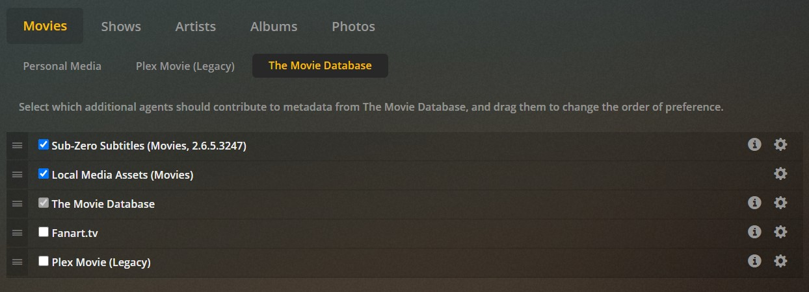

# Sub-Zero

Sub-Zero is a great, lightweight alternative to Bazarr. Both almost do the same thing but Sub-Zero comes in handy when immediate subtitles are needed. Sub-Zero might get obsolete in the near future.

- Download the release from [here](https://github.com/pannal/Sub-Zero.bundle/releases)

- Upload the ```Sub-Zero.bundle``` folder to ``` /home/hd*/username/.docker-conf/Library/Application Support/Plex Media Server/Plug-ins```

- Restart Plex

- Go to Setting -> Agents in Plex

- Checkmark Sub-zero and move to the top according to the agent you are using.

- Configure Sub-Zero through the "settings wheel" icon.

  - Almost all settings will remain to default.
  - Choose which subtitle language you need, where to store it and when to fetch.
  - Put logins or API keys accordingly

- You can also find Sub-Zero inside Settings->Manage->Plugins.

  


