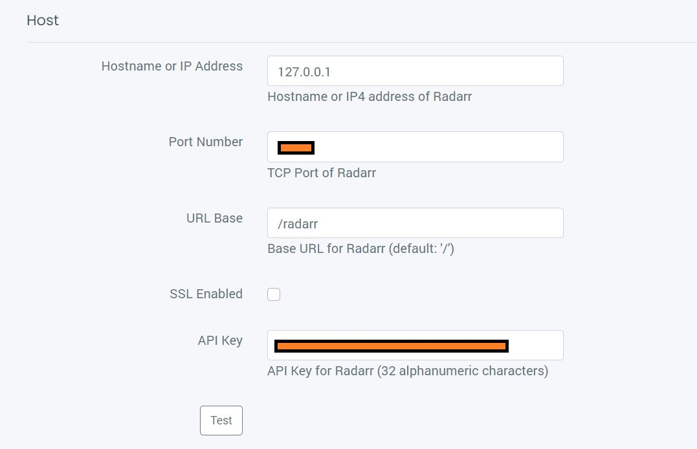

# Bazarr

- Bazarr will help to manage subtitles for you according to what Sonarr and Radarr are managing.

- Most of the default settings works for Bazarr. We will setup few mandatory things.

- Go to Settings->Languages

- Set what languages of subtitles you need

  

- Save it

- Then go to Settings->Providers and set all the subtitle providers according to what languages you set previously.
- For some you might need to set API key where as for some you need login details. 
- As a starting point set these
  - OpenSubtitles.org (must)
  - Podnapisi
  - Subscenter

- Now lets link Radarr and Sonarr to Bazarr

- Go to Settings->Radarr

  - Hostname will by default to localhost(127.0.0.1) and port will be automatically filled to what port you see on the dashboard for Radarr
  - Put URL path as /radarr
  - Put Radarr's API key. You can go to Settings->General in Radarr to see your Radarr API key.

  

- Test it. Sometimes it spins infinitely. So to actually test if it is working or not, you need to download something and wait for Bazarr to fetch downloaded content from Radarr. 

- Link Sonarr in the same way.

Note: You can go to System->Tasks in Bazarr to figure out at in how much time interval, a specific task will get executed.