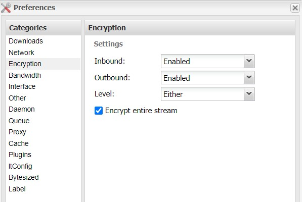
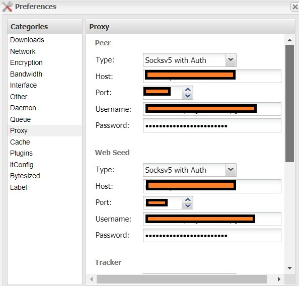
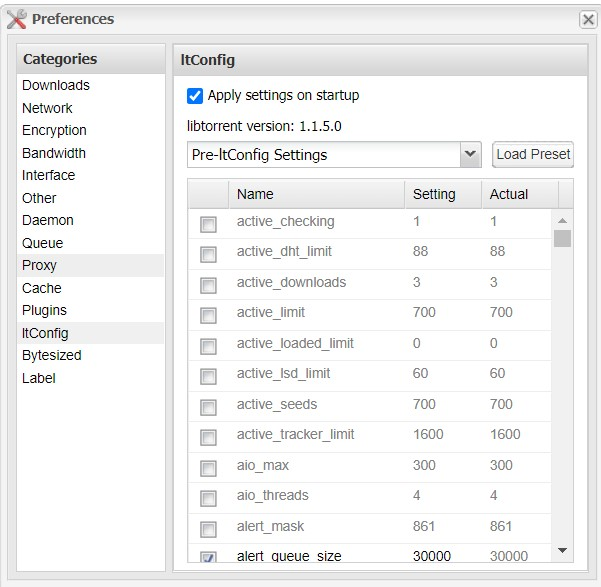
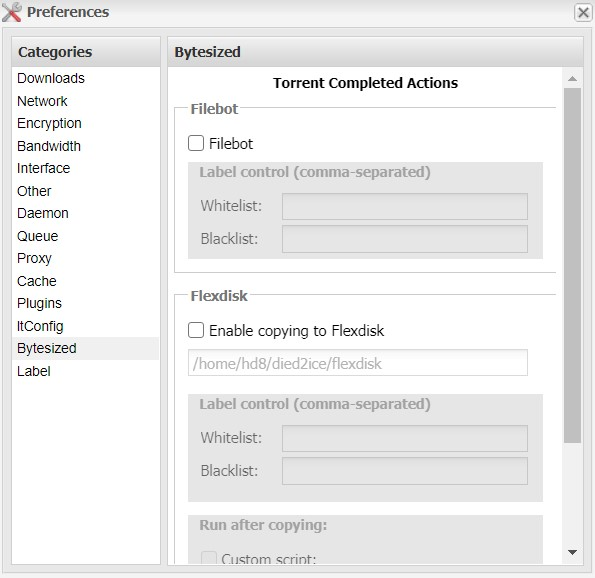

# Deluge

For downloading torrents, deluge is used. 

### Reminder - You have to have a VPN service that provides SOCK5 protocol. It is a must or otherwise you should not consider downloading through torrent.  NordVPN, IPVANISH, PIA etc. are some that provides SOCK5 servers.

- We will go through the main settings, rest of the optional settings, you can fiddle around with those according to your needs like maximum connections, seed ratio etc.
- Go to Preferences -> Encryption
  - It should be enabled
  
    
- Go to Preferences -> Proxy
  - This is the most important setting. You have to setup "Sock5 proxy with Auth" for all sections.
  - All the info will be provided by your VPN service.
  
    
- Go to Preferences -> Itconfig
  - You need to have this which enhances the working of torrenting.
  
  - Keep the default settings like this. 
  
  - If you can't see, it means you need to download the .egg file from [here](https://github.com/ratanakvlun/deluge-ltconfig/releases/tag/v2.0.0) and upload it inside ~/.config/deluge/plugins through Filezilla or using any FTP software.
  
    
- Go to Preferences -> Filebot
  - Uncheck this as we will let Radarr do the rename handling.
  
    
  
- Apply and Save

- Do cross check the I.P leak from [IPLEAK.NET](https://ipleak.net/) . 
  - Scroll down to "Torrent Address detection" -> Activate
  - Copy the magnet, put in Deluge
  - Click the Torrent and see the "Status" at the bottom
  - The "Tracker Status" should say "Announce Sent"
    - If it is showing "I.P connection timeout error" means that Sock5 server not working.
  - After that, go to the website again, click refresh button (not browser refresh) and see what I.P is it showing. It should show the server I.P which you put in as Sock5 server or in other words it should not be the I.P of the Bytesized server.
    - Announce connection can take a minute or so to be reflected on the ipleak website.