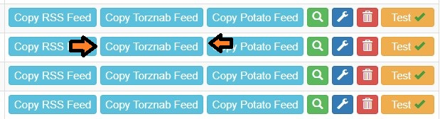

# Jackett

- This is mainly used to take away the job of indexers from Radarr and Sonarr. Also since it supports more indexers as compared to Radarr and Sonarr, it is worth having it.

- Steps are easy. After installing, Click on "check for updates" button.

- Give it few minutes to update and cross verify from the logs if it is updated or not.

- Now add an indexer of your choice be it for Movies or Series.

- Now, only two things are needed.

  - Torznab feed of that particular indexer

  - API key of Jackett (at the top).

  - Note these down.

    

- The next steps needs Radarr or Sonarr. So you can finish the setup of [Radarr guide](https://github.com/pranscript/plex_bytesized/tree/master/radarr) and can continue from here.

- Go to Radarr or Sonaar->Settings->Indexer->+

- Chose "Torznab Custom" 

  - Paste "Torznab feed" that you copied inside URL
  - Paste Jackett API key inside API key field.
  - Enable both search and RSS sync
  - Test the connection and Save.

- Note: Test button on Jackett sometimes shows error but on Radarr or Sonarr, test shows successful. It is normal if test fails.

