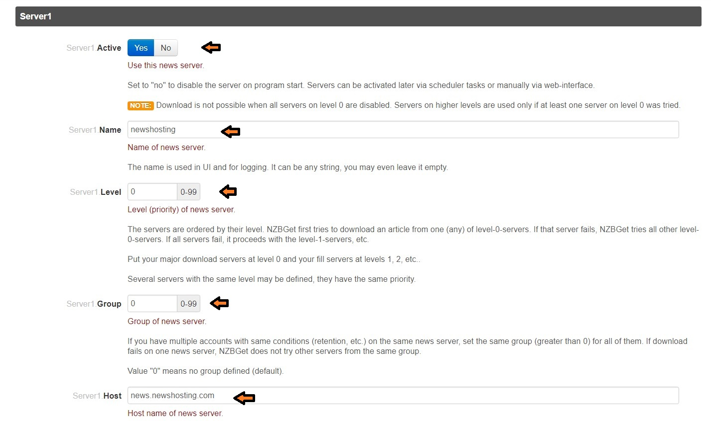
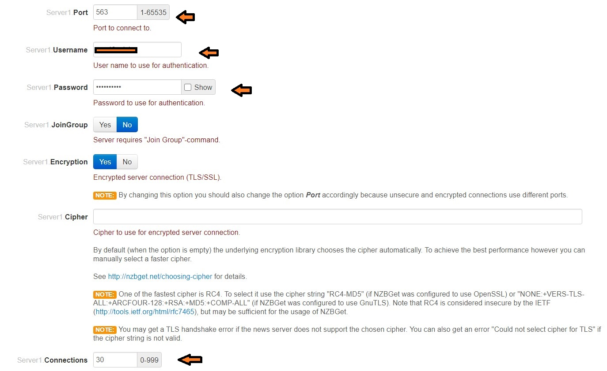

# Nzbget

- The first thing you need is a Usenet server.
  - You can visit [this link](https://www.reddit.com/r/usenet/wiki/providers) for additional info.
  - I will recommend [Newshosting](https://www.newshosting.com/), [Eweka](https://www.eweka.nl) etc.
- We will be using Nzbget for downloading from Usenet servers.
- Only two things are there to change in the Nzbget settings.

1) Usenet Server Settings - Go to settings and select NEWS-SERVERS and input the information about your Usenet server. 

- Choose any name
- Level 0 is necessary if you have only 1 server.
- Put Group as 0
- Host is the URL if will be connecting to! This information will be available to you in the Usenet dashboard.

- Port 563 is used as SSL port. You must have two ports given to you. Use SSL port here.
- Put your username of Usenet server.
- Password of Usenet server.
- Encryption as "Yes" id you put SSL port. "No" if you put normal port.
- Connections provided to you by your provider. Remember Sonarr and Radarr will use the same connection so divide between them.
- Test the connection. It should show "Success".

2) Remove Filebot

- Go to extension scripts and remove filebot.py.
- This is done as we will let Radarr do the renaming stuffs. 

Scroll down, save the changes, reload and confirm that in the logs, error or warnings messages are not present.. 

If not then Nzbget Done!!