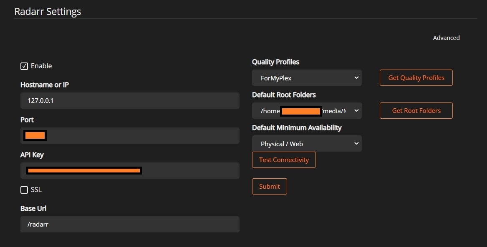
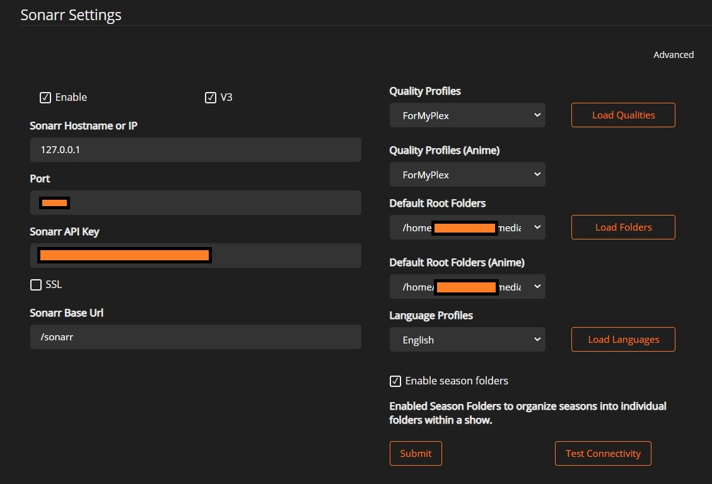
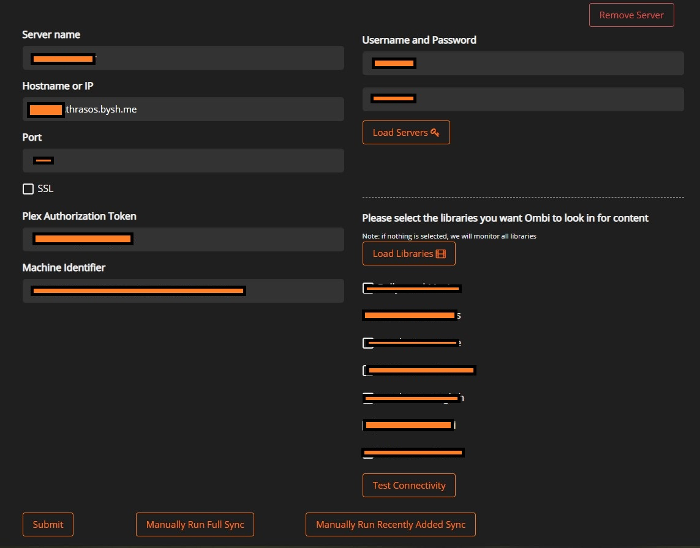

# Ombi

OMBI manages your client's Movies and Series requests. ( Update - I personally use [Requestrr](https://github.com/darkalfx/requestrr) nnow which uses discord to request)

- First step is to connect Radarr
  - Go to Settings->Moveis->Radarr
  - Check "Enable"
  - Put hostname as "localhost" or "127.0.0.1". Makes sure you write it manually as default value is a placeholder.
  - Port of Radarr
  - API key of Radarr
  - Uncheck SSL (we don't need as all OMBI will connect internally with Radarr)
  - Base URL should be /radarr
  - Click on "Get Quality Profiles" and choose one
  - Click on "Get Root Folders" and choose one
  - Choose minimum availability
  - Test connectivity and Submit.
  
    

- Same process for Sonarr
  - Go to Settings->TV->Sonarr
  - Check "Enable" and "V3"
  - Put hostname as "localhost" or "127.0.0.1". Makes sure you write it manually as default value is a placeholder.
  - Port of Sonarr
  - API key of Sonarr
  - Uncheck SSL
  - Base URL should be /sonarr
  - Click on "Get Quality Profiles" and choose one
  - Click on "Load Folders" and choose one
  - Click on "Load Language" and choose one
  - Check "Enable Seasons Folder"
  - Test connectivity and Submit.
  
    

- Connect Plex to OMBI

  - Go to Settings->Media Server->Plex

  - Check "Enable" and click "Add server"

  - Hostname should be "username.servername". Both the details are present on Bytesized dashboard.

  - Put plex port. Again, can be seen by clicking "+" in Plex card on the Bytesized dashboard.

  - Uncheck SSL

  - Now put plex username and password on the right side and login

  - Once successful, "Plex Authorization Token" and "Machine Identifier" will fill by itself. If hostname changed, set it again to what we set it earlier.

  - Check the libraries you want to load. Can add later too

  - Test connection and submit.

    

- Note:
  - To give access to OMBI access to plex clients, you need to import to "Settings->User Importer" and set roles for them.
  - Can set discord etc for notifications.