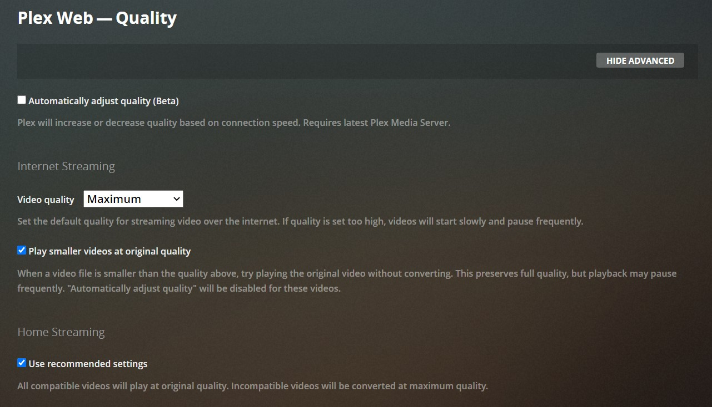
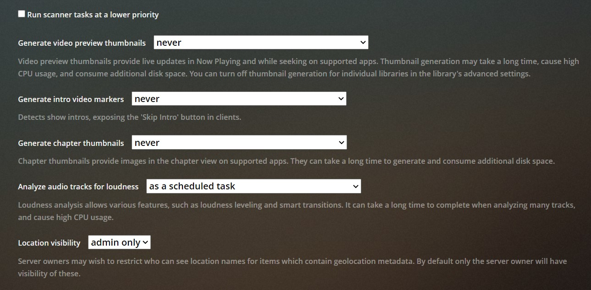
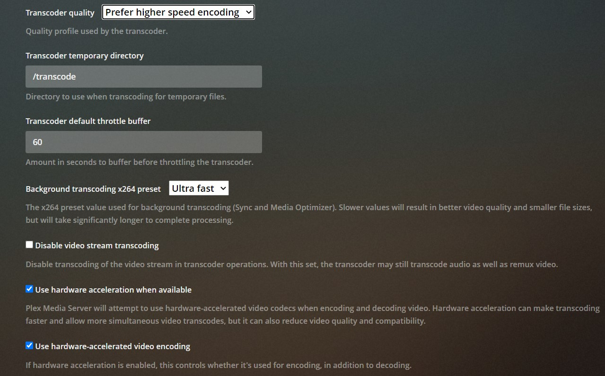
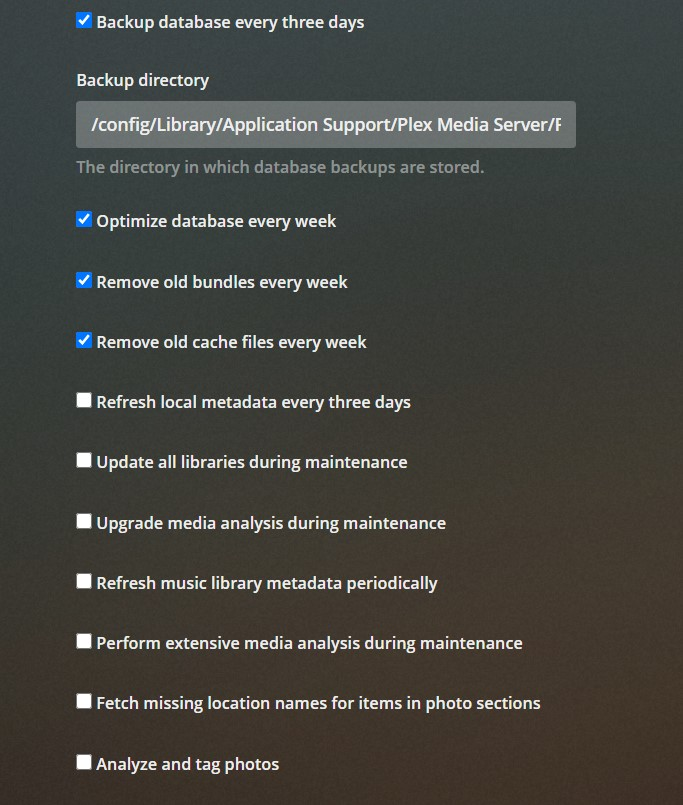

# Plex

Till now Radarr is communicating with Nzbget and Deluge. Now it is time to load up the downloaded content on Plex.

## 1. Settings

- Login to Plex

- First step is to change the quality to Maximum since you don't want Plex to transcode unnecessarily

- go to Settings-> Quality

  

- Now you would want to automatically update the library once Radarr sends a signal of a new download.

- For this, go to Settings->Library and then

  - **Check** "Scan Library automatically"
  - **Check** "Run partial Scan"
  - **Uncheck** "Scan my library periodically"
  - **Uncheck** "Empty trash automatically after every scan"
  - Choose **"Never"** to all 3, "Generate Video Preview Thumbnails", "Generate intro video markers" and "Generate chapter thumbnails"
  - These steps are done to minimize CPU processing and API calls to drive.

  

- Go to Settings->Transcoder and Enable "hardware acceleration". It will use only if you have plex pass.

  

- Go to Settings->Schedule Tasks and mark according to the image below.

  

## 2. Library

- After settings, create a Movie library for the movies.
- Put folder path as **"/data/mnt/media_merge/yourFolder"**
  - Remember that folder that you are trying to select must be present in the google drive, then only it will show inside media_merge.
  - "media_merge" is the mirror image of google drive
- Remember, the path should go from "media_merge" as then only Plex will be able to find any new downloads instantly.
- In advanced
  - **Disable** Cinema Trailers
  - **Disable** video preview thumbnails
- Again, these steps are done to minimize unnecessary CPU load.
- Note: Quality settings has to be set maximum on every client mobile app, desktop app, T.V app or web browser.