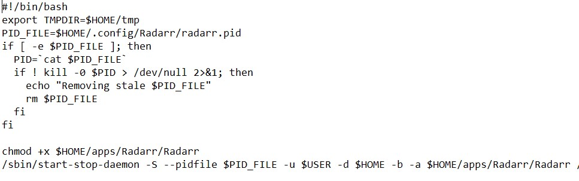

# RadarrV2 to RadarrV3 (nightly) 

If you are still in version 2 then you can follow the steps to change it to version 3. Remember, at the time of writing, it is in "nightly" means not stable as version 2. But I am quite satisfied with constant updates till now and the new features and performance is worth it.

1. Make a backup of Radarr folder, both in ~/apps and ~/.config just in case

2. Open Radarr->Settings->General->Show Advance Settings->Updates

3. Change from develop to nightly and save it.

4. Go to System->Updates

5. Install the latest and let it restart. If it doesn't restart then manually restart. Now stop Radarr.

6. Go to [Radarr Wiki](https://github.com/Radarr/Radarr/wiki/Health-checks#update-to-net-core-version)

7. Download x64 and uzip

8. Replace the Radarr folder inside this zip with the Radarr folder in ~/apps

9. Open ~/.startup/radarr file.

10. Change nzbdrone.pid to radarr.pid (if you can see)

11. Change Radarr.exe to Radarr (just remove .exe wherever you find it) 

    

12. Save it 

13. sh```chmod +x ~/.startup/radarr```    // Run this just in case

14. Restart Radarr