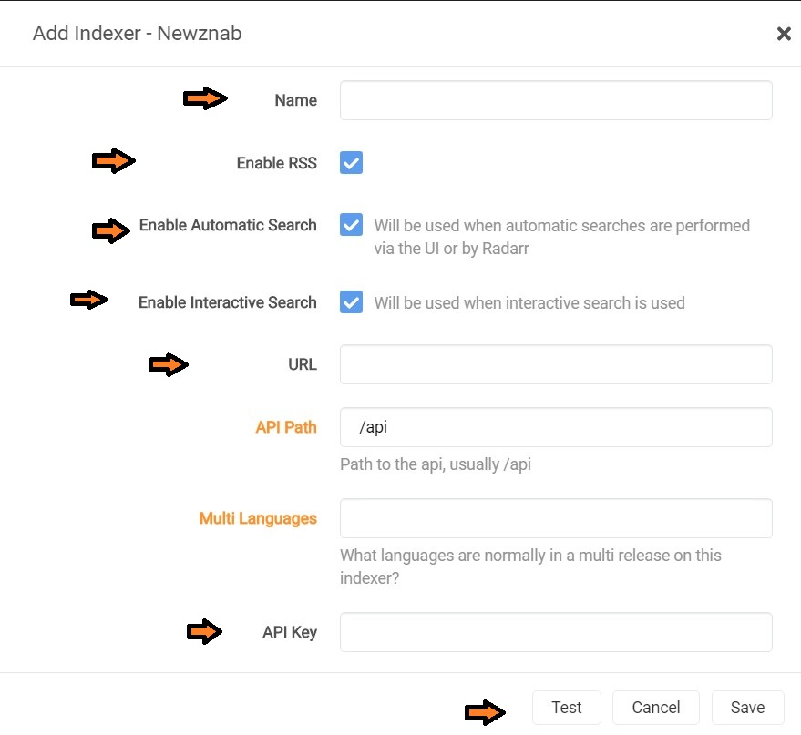
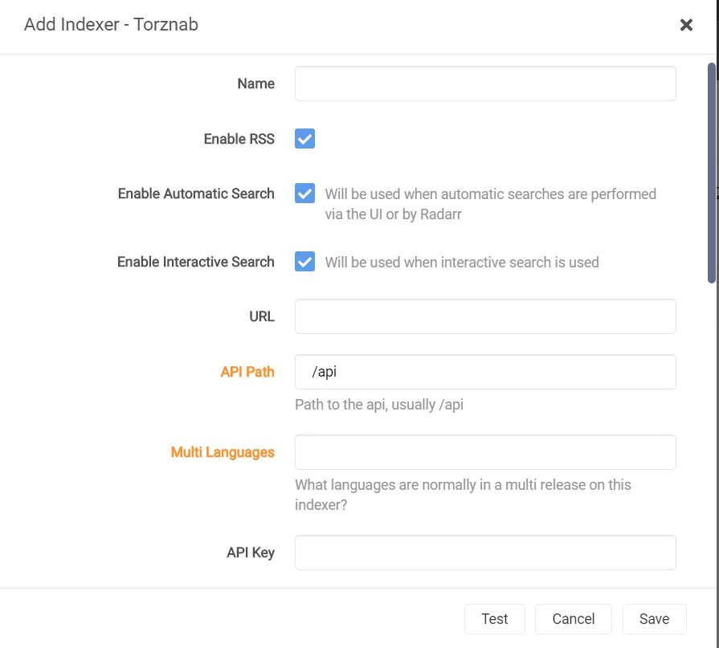
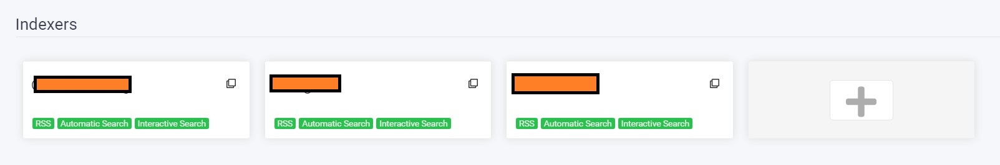
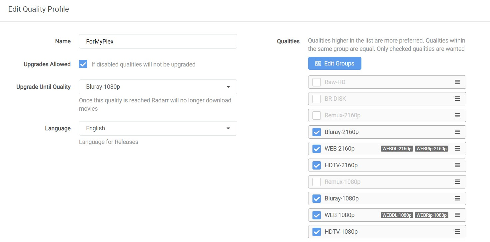
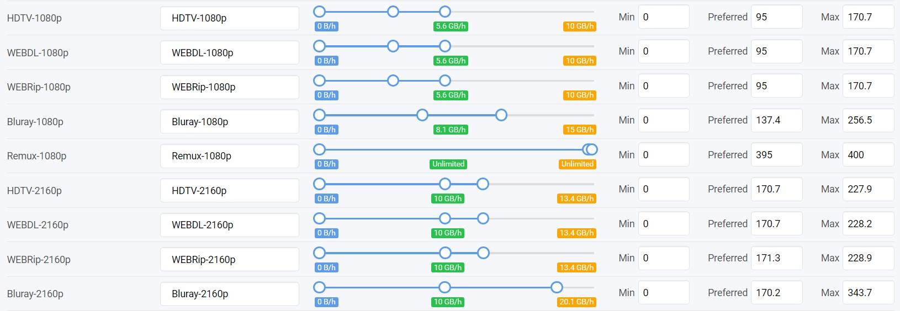
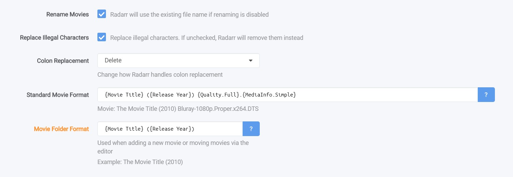
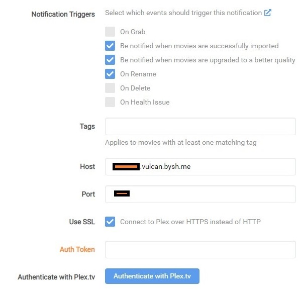
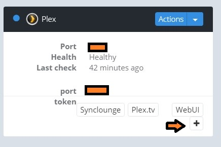
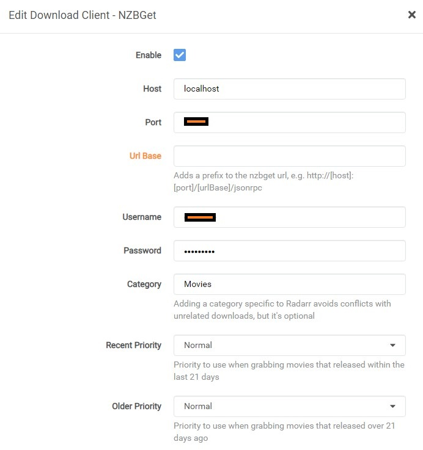

# Radarr

Note: These steps are for Radarr V3. If you are still in Radarr V2, you can refer [this guide](radarrV2 to V3(nightly).md) to update to V3.

- The first step is to get Usenet indexers and torrent indexers.
- Then go to settings and click on "Show advanced settings". This will be helpful to change specific settings.

### 1. Indexer Setup

- Set up the indexers in Radarr by going to Settings->Indexers.

- Click on ""+"" to add an Indexer.

- You will have two options. Usenet Indexer and Torrent Indexer. Some predefined famous indexers are also there but we will choose custom settings.

- For Usenet Indexer, select if it is Newznab supported or Omgwtfnzbs supported. I will use Newznab as it the most common one.

  

- Fill out the details marked. URL and API key will be provided to you by the indexer and click on "Test" to check the connection

- After successful connection. Save it.

- For torrent indexers, we will use Jackett that we set up at the starting. Remember that Jackett is helpful when you want to add many torrent indexers. 

- Same steps to a add a torrent indexers.

- For torrent indexers, we will use Jackett that we set up at the starting. Remember that Jackett is helpful when you want to add many torrent indexers. 

- Same steps to a add a torrent indexers.

- Click on ""+"" and this time select "Torznab" since we are using Jackett to handle it for us

- Fill any name, copy Torzab URL and Jackett's API and put it here.

- Test the connection and save.

- Some might fail which is normal.

  

- After adding multiple, the indexer screen will look like this.

  

  

### 2. Setting up Profiles

- Go to Settings->Profiles to setup your custom requirement qualities you want to download or you can use already defined profiles

- Below is just an example which will stop upgrading till Bluray-1080 is not reached.

  

### 3. Setting up Quality

- Go to Settings->Quality to set the size of each quality you want to have. The rule is simple here. You don't want a less quality to have a large size. It is not worth it. Moreover, just follow "GB per hour rule" and the internet speed. 

- According to my experience, 100Mbps speed can stream a 30GB file size but struggles to play above 40GB. Also for a file size close to 50GB or above, prefer having 200Mbps connection speed to stream without buffering.

- Below is an example. These are not perfect so you can set your own according to your needs.

  

### 4. Media Management

- This is an important step as content should be named correctly for plex to identify it correctly.

- Since we are not using Filebot or Olaris-rename, Radarr should rename all the files correctly.

- Radarr by default puts the file inside its movie folder which will come handy in future.

- Below is an example. Make sure "Title" along with "Year" is there for Plex to work correctly.

  

### 5. Connect Plex to Radarr

- Do this step after installing your plex.

- Go to Settings->Connect

- This connection is necessary to inform plex about new content so than it can automatically add content to the library.

- Host will be in this format - <username.servername> Both values can be found in the Bytesized dashboard.

- For Plex port, click on the "+" icon to see the port to connect to. 

- Use SSL, authenticate and check update library

- Test the connection and save it.

  

  

### 6. Connect  Download client (Nzbget)

- Go to Settings->Download Client

- Host is localhost as Radarr and Nzbget are installed locally so they can communicate within localhost connection

- Port you can find on the Bytesized dashboard by clicking the "+" icon on Nzbget card.

- Password is same password that you put while installing Nzbget.

- Mark it Enable, test the connection and Save.

  

### 7. Enable "Completed Download Handling"

- This is necessary to let Radarr fetch what is downloaded from the download client, in our case Nzbget.
- Go to Setting->Download Clients->Completed Download Handling
- Enable "Automatically Import Completed Downloads"

### 8. Restart Radarr