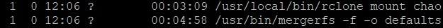

# Plex Server Setup 

Though many of you must have seen tremendously good wikis and tutorials on how to setup, this is obviously one of those too. But it is mainly focused on hosting on Bytesized-Hosting provider. Also, I will be linking most of the stuffs to other tutorials from where I got the information. 

What is the end result?
  1. Rclone mount
  2. Plex server setup
  3. Radarr for Movies
  4. Sonarr for T.V Shows
  5. Nzbget for NZB handling 
  6. Deluge (Torrent)
  7. Jackett (Indexer)
  8. Ombi (User Requests)
  9. Bazarr (Subtitles)
  10. Filebot (Optional)

What it doesn't include and why?
  1. Couchpotato (since Radarr is much better)
  2. Sickbeard / Sickrage (since Sonarr is more stable)
  3. Olaris Rename (works great but Filebot is supreme)
  4. Cardigann (Jackett works better)

# Pre-requisites
  - Bytesized account
  - SSH (Putty for Windows)
  - Filezilla (FTP application for easy handling of files)

# 1. Rclone

	1) Run "rclone config"
	2) press n
	3) Give name
	4) Choose 13 for Google Drive
	5) Put Clinet Id
	6) Put Client Secret
	7) Put 1 (scope full access)
	8) Root folder default
	9) Service account default
	10) Choose 'N' for Advanced config
	11) Choose 'N' for Auto config (since we are in a headless machine) (a link will show, copy with highligting it and open in browser, login, click advanced, go to rclone, allow)
	12) Y (If it is a google team/shared drive)
	13) Write your team drive number if you selected "Y" above
	13) Y (after checking all is fine)

# 2. Mounting Drive and Mergerfs

We will follow this wonderful tutorial - [Bytesized Tutorial](https://bytesized-hosting.com/pages/setting-up-rclone-mergerfs-and-crontab-for-automated-cloud-storage). Some few minor changes I did to the original. So let us continue.
We will create the following folder through SSH on server:

```sh
mkdir ~/mnt
mkdir ~/mnt/gdrive
mkdir ~/mnt/media_merge
mkdir ~/media_tmp
mkdir ~/scripts
mkdir ~/.config/mergerfs
```

You can follow the link and create a startup and shutdown script if you want to use gcrypt otherwise, you can continue from here. Both the script are created so that while restarting the appbox, rclone mount and mergerfs automatically starts on its own.

So, open a file using nano to create a startup script.

```sh
nano ~/.startup/gdrive
```

Paste the following code there (Copied from the tutorial mentioned above)

- I have added few additional parameters to rclone which works good for plex.
- Remember to replace mountName with your mount name in rclone execution code down below. Remove < > too.
- Remember to change USER_ID, GROUP_ID, USER_AGENT in the code below. First two can be seen by typing ```id``` in terminal.(create another SSH session to find this). USER_AGENT can be any random string. So let's create the startup script.

```sh
#!/bin/bash

USER_ID=XXXXX
GROUP_ID=XXXXX
USER_AGENT=XXXXXXXXXXXXXXXXX

export TMPDIR=$HOME/tmp
PID_FILE=$HOME/.config/rclone/rclone.pid
if [ -e $PID_FILE ]; then
    PID=`cat $PID_FILE`
    if ! kill -0 $PID > /dev/null 2>&1; then
        echo "Removing stale $PID_FILE"
        rm $PID_FILE
    fi
fi

/sbin/start-stop-daemon -S --pidfile $PID_FILE --make-pidfile -u $USER -d $HOME -b -a /usr/local/bin/rclone -- mount <mountName>: ~/mnt/gdrive --allow-other --user-agent="$USER_AGENT" --timeout 1h --dir-cache-time 72h  --poll-interval 15s --vfs-read-chunk-size 16M --uid $USER_ID --gid $GROUP_ID --vfs-cache-mode writes

PID_FILE=$HOME/.config/mergerfs/mergerfs.pid
if [ -e $PID_FILE ]; then
    PID=`cat $PID_FILE`
    if ! kill -0 $PID > /dev/null 2>&1; then
        echo "Removing stale $PID_FILE"
        rm $PID_FILE
    fi
fi

/sbin/start-stop-daemon -S --pidfile $PID_FILE --make-pidfile -u $USER -d $HOME -b -a /usr/bin/mergerfs -- -f -o defaults,sync_read,auto_cache,use_ino,allow_other,func.getattr=newest,category.action=all,category.create=ff $HOME/media_tmp:$HOME/mnt/gdrive $HOME/mnt/media_merge
```

Save it.

Now create a shutdown script using similar process.

```sh
nano ~/.shutdown/gdrive
```
Paste this there (Copied from the tutorial mentioned) above)
```sh
#!/bin/bash

PID_FILE=$HOME/.config/rclone/rclone.pid
/sbin/start-stop-daemon --pidfile $PID_FILE -u $USER -d $HOME -K -a /usr/local/bin/rclone

if [ -e $PID_FILE ]; then
    PID=`cat $PID_FILE`
    if ! kill -0 $PID > /dev/null 2>&1; then
        echo "Removing stale $PID_FILE"
        rm $PID_FILE
    fi
fi

PID_FILE=$HOME/.config/mergerfs/mergerfs.pid
/sbin/start-stop-daemon --pidfile $PID_FILE -u $USER -d $HOME -K -a /usr/bin/mergerfs

if [ -e $PID_FILE ]; then
    PID=`cat $PID_FILE`
    if ! kill -0 $PID > /dev/null 2>&1; then
        echo "Removing stale $PID_FILE"
        rm $PID_FILE
    fi
fi
```
Now to make both the files executable, run the following command
```sh
chmod +x ~/.startup/gdrive
chmod +x ~/.shutdown/gdrive
```

Now create a script that will upload from local to google drive.

As you can see, local files re in "media_tmp" and will be moved to mount that you created and deleted from local seamlessly 

```sh
#open a file
nano ~/scripts/uploadmedia
# paste the below line there
screen -dmS uploadmedia /usr/local/bin/rclone move ~/media_tmp <mountName>: --delete-empty-src-dirs -v --stats 5s 
# replace mountName that you put in rclone config and do not include < >
# Press Ctrl + X
# Press Y for yes.
# Press Enter to confirm file name.
chmod +x ~/scripts/uploadmedia  # to make the script executable.
```
Now a crontab that will upload automatically the content from local to mount according to the script that we just made,at a specific time:
```sh
crontab -e
# Put below line in the file
0 5 * * * ~/scripts/uploadmedia
# Save it by pressing Ctrl + X,  Y and the Enter
```

You can visit [crontab.guru](https://crontab.guru/) to understand the convention of setting up the time.

Lastly, restart the appbox and wait few minutes to check.

To cross check if both rclone and mergerfs is working, you can check from the memory usage dashboard or run ```ps -ef``` in the terminal to see both are running. 



# Utilities


| Order | Utility | Guide                                                        | Support                                                      |
| ----- | ------- | ------------------------------------------------------------ | ------------------------------------------------------------ |
| 3.    | Nzbget  | [Nzbget](https://github.com/pranscript/plex_bytesized/tree/master/nzbget) | [Github](https://github.com/nzbget/nzbget) [Forum](https://forum.nzbget.net/) |
| 4.    | Deluge  | [Deluge](https://github.com/pranscript/plex_bytesized/tree/master/deluge) | [Github](https://github.com/deluge-torrent/deluge) [Forum](https://forum.deluge-torrent.org/) |
| 5.    | Jackett | [Jackett](https://github.com/pranscript/plex_bytesized/tree/master/jackett) | [Github](https://github.com/Jackett/Jackett) [Reddit](https://www.reddit.com/r/Jackett/) |
| 6.    | Radarr  | [Radarr](https://github.com/pranscript/plex_bytesized/tree/master/radarr) | [Discord](https://discord.gg/u3x3Kp8) [Github](https://github.com/Radarr/Radarr) [Reddit](https://www.reddit.com/r/radarr) |
| 7.    | Sonarr  | [Sonarr](https://github.com/pranscript/plex_bytesized/tree/master/sonarr) | [Discord](https://discord.gg/M6BvZn5) [Github](https://github.com/Sonarr/Sonarr) [Forum](https://forums.sonarr.tv/) [Reddit](https://www.reddit.com/r/sonarr) |
| 8.    | Plex    | [Plex](https://github.com/pranscript/plex_bytesized/tree/master/plex) | [Forum](https://forums.plex.tv/)                             |
| 9.    | Bazarr  | [Bazarr](https://github.com/pranscript/plex_bytesized/tree/master/bazarr) | [Discord](https://discord.com/invite/MH2e2eb) [Github](https://github.com/morpheus65535/bazarr) [Reddit](https://www.reddit.com/r/bazarr/) |
| 10.   | Ombi    | [Ombi](https://github.com/pranscript/plex_bytesized/tree/master/ombi) | [Discord](https://discord.gg/Sa7wNWb) [Github](https://github.com/tidusjar/Ombi) |
| 11.   | Filebot | [Filebot](https://github.com/pranscript/plex_bytesized/tree/master/filebot) | [Forum](https://www.filebot.net/forums/)                     |

# Extra


| Index | Topic                                                        |
| ----- | ------------------------------------------------------------ |
| 1.    | [Radarr 4K Instance](https://github.com/pranscript/plex_bytesized/tree/master/Extras/radarr4K.md) |
| 3.    | [SubZero bundle for Subtitles (Bazarr Alternative)](https://github.com/pranscript/plex_bytesized/tree/master/Extras/subzero.md) |